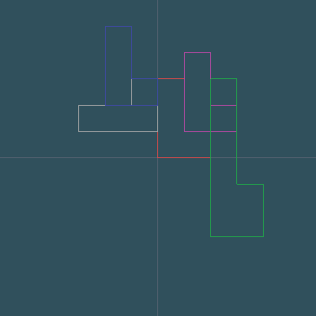

# ข้อที่ 3 สรุปผลการทำงานของโปรแกรม 


__รูปที่ 1__ (สีแดง) ถูกสร้างตามจุดที่ plot ไว้ในฟังก์ชัน `drawShape()`

```cpp
void drawShape(){
	glBegin(GL_POLYGON);
	glVertex2f(0,0);
	glVertex2f(2,0);
	glVertex2f(2,1);
	glVertex2f(1,1);
	glVertex2f(1,3);
	glVertex2f(0,3);
 	glEnd();
}
```
___

__รูปที่ 2__ (สีขาว) ได้รับผลจากฟังก์ชัน `glTranslate(1, 0, 0)` ทำให้เคลื่อนที่ไปทางขวา 1 หน่วย (X เพิ่ม) และหมุนทวนเข็มนาฬิกา 90 องศารอบแกน Z จากฟังก์ชัน `glRotate(90, 0, 0, 1)`
>เพราะว่ามีการขยับรูปไปด้านขวาและหมุนรอบจุดกำเนิด (0, 0) ทำให้ตำแหน่งของรูปสูงขึ้น 

```cpp
...
glRotate(90, 0, 0, 1);	
glTranslate(1, 0, 0);  
drawShape(); // shape 2  
...
```
___

__รูปที่ 3__ (สีม่วง) ได้รับผลจากฟังก์ชัน `glTranslate(1, 0, 0)` หลังจากเรียกใช้ฟังก์ชัน `glPushMatrix()` และฟังก์ชัน `glRotate(-90, 0, 0, 1)` และทุกฟังชั่นก่อนหน้า ทำให้ได้รูปที่ออกมาเหมือนรูปที่ 2 เพียงแต่จะมีการขยับไปด้านขวา 1 หน่วยและหมุนตามเข็มนาฬิกา 90 องศารอบแกน Z ก่อน
> เนื่องจากฟังก์ชัน `glPushMatrix()` จะทำการ push matrix stack ลงไปแล้วคัดลอก matrix ปัจจุบันมาเป็นชั้นบนสุดทำให้ matrix ชั้นบนสุดจะมีข้อมูลเหมือนกับ matrix ชั้นล่างลงไป 1 ชั้น 

```cpp
...
glRotate(90, 0, 0, 1);	
glTranslate(1, 0, 0);  
...
glRotate(-90, 0, 0, 1);  
glPushMatrix();
glTranslate(1, 0, 0);   
drawShape(); // shape 3  
...
```
___

__รูปที่ 4__ (สีเขียว) ได้รับผลจากฟังก์ชัน `glTranslate(1, -2, 0)` และฟังก์ชัน `glScale (1, 2, 1)` และผลจากทุกฟังก์ชันก่อนหน้าทำให้ได้รูปที่เหมือนกับรูปที่ 3 เพียงแต่มีการขยับไปด้านขวา 1 หน่วยลงไปด้านล่าง 2 หน่วย (Y ลด) และปรับขนาดตามแกน Y เป็น 2 เท่าก่อน

```cpp
...
glRotate(90, 0, 0, 1);	
glTranslate(1, 0, 0);  
...
glRotate(-90, 0, 0, 1);  
...
glTranslate(1, 0, 0);   
...
glScale(1, 2, 1);
glTranslate(1, -2, 0);
drawShape(); // shape 4
...
```
___

__รูปที่ 5__ (สีน้ำเงิน) ได้รับผลจากฟังก์ชัน `glTranslate(-2, 1, 0)` หลังจากเรียกใช้ฟังก์ชัน `glPopMatrix()` และฟังก์ชัน `glRotate(-90, 0, 0, 1)` ก่อนเรียกใช้ฟังก์ชัน `glPushMatrix()` และทุกฟังก์ชันก่อนหน้าทำให้ได้รูปที่เหมือนรูปที่ 2 เพียงแต่มีการขยับไปด้านซ้าย 2 หน่วย  (X ลด) ไปด้านบนหนึ่งหน่วย (Y เพิ่ม) และหมุนตามเข็มนาฬิกา 90 องศารอบแกน Z ก่อน
> ทุกฟังก์ชันที่อยู่ระหว่างฟังก์ชั่น `glPushMatrix()` และฟังก์ชั่น `glPopMatrix()` จะไม่ส่งผล 

```cpp
...
glRotate(90, 0, 0, 1);
glTranslate(1, 0, 0);
...
glRotate(-90, 0, 0, 1);
glPushMatrix();
...
glPopMatrix();
glTranslate(-2, 1, 0);
drawShape(); // shape 5
```